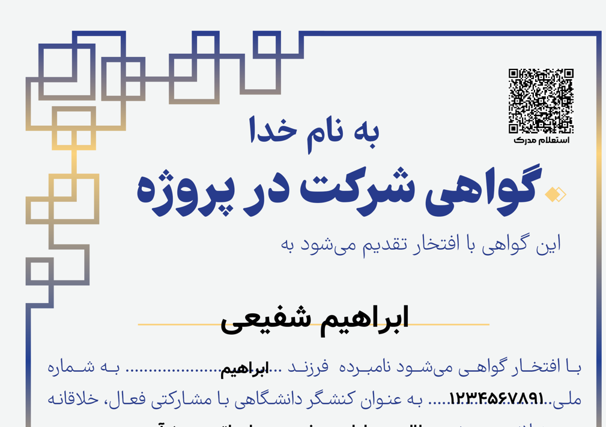

# 📦 Abdal Phpian Render

[English](README.en.md) | [فارسی](README.md)

<div dir="rtl" align="right">



</div>


<div dir="rtl">

## 📖 درباره پروژه

پروژه **Abdal Phpian Render** یک پکیج جامع PHP برای اصلاح و بهبود نمایش متون فارسی در محیط‌های گرافیکی است. این پکیج مشکلات رایج نمایش متن در کتابخانه‌هایی مانند GD Library، FPDF و TCPDF را حل می‌کند و پشتیبانی کامل از راست‌به‌چپ (RTL) را فراهم می‌آورد.

### 🎯 چرا این نرم‌افزار ساخته شد؟

هنگام کار با متون فارسی در محیط‌های گرافیکی PHP، مشکلات متعددی وجود دارد:

- **مشکل نمایش حروف**: حروف فارسی به صورت جداگانه و بدون اتصال نمایش داده می‌شوند
- **مشکل ترتیب نمایش**: در متون ترکیبی (فارسی + انگلیسی) ترتیب کلمات به درستی نمایش داده نمی‌شود
- **مشکل اعداد**: اعداد انگلیسی در متن فارسی ظاهر می‌شوند
- **مشکل علائم نگارشی**: پرانتز، براکت و سایر علائم در جهت اشتباه نمایش داده می‌شوند
- **از دست رفتن اعراب**: اعراب فارسی در فرآیند پردازش از بین می‌روند

این پکیج تمام این مشکلات را حل می‌کند و یک راه‌حل کامل و استاندارد برای رندر متون RTL ارائه می‌دهد.

## ✨ ویژگی‌ها و قابلیت‌ها

### 🔤 الگوریتم Reshaping

- ✅ تبدیل حروف به اشکال چهارگانه (isolated, final, initial, medial)
- ✅ پشتیبانی کامل از حروف اختصاصی فارسی (پ، چ، گ، ژ)
- ✅ پشتیبانی از ترکیبات Lam-Alef فارسی (لا، لآ)
- ✅ حفظ اعراب در فرآیند reshaping

### 🔄 الگوریتم BiDi (Bidirectional)

- ✅ تشخیص خودکار ترتیب نمایش در متون ترکیبی (فارسی + انگلیسی)
- ✅ آینه‌سازی خودکار علائم نگارشی (پرانتز، براکت، آکولاد و...)
- ✅ مدیریت هوشمند علائم خنثی بر اساس context

### 🔢 تبدیل اعداد (Number Converter)

- ✅ تبدیل اعداد انگلیسی به فارسی
- ✅ تبدیل خودکار اعداد فارسی به انگلیسی (برای محاسبات)

### 🔣 مدیریت اعراب (Diacritics Handler)

- ✅ استخراج و حفظ اعراب (فَتحه، ضَمّه، کَسره، تنوین و...)
- ✅ اعمال مجدد اعراب پس از reshaping
- ✅ جلوگیری از از دست رفتن اعراب در فرآیند پردازش

### 🛠️ توابع کمکی (Helper Functions)

- ✅ `wordWrap()`: شکستن خط مخصوص متون RTL (جلوگیری از شکسته شدن ناقص کلمات)
- ✅ `isRTL()`: تشخیص خودکار زبان متن ورودی
- ✅ `reverse()`: معکوس کردن متن
- ✅ `clean()`: پاکسازی از کاراکترهای نامرئی و ناخواسته

### 📋 استانداردهای رعایت شده

- ✅ **PSR-12**: رعایت کامل استانداردهای کدنویسی PHP
- ✅ **Type Hinting**: استفاده کامل از type hints برای امنیت نوع داده
- ✅ **PHP 8.1+**: سازگاری کامل با نسخه‌های جدید PHP
- ✅ **Lightweight**: وابستگی سبک (فقط `symfony/polyfill-mbstring`)
- ✅ **Unit Tests**: تست‌های کامل با PHPUnit
- ✅ **Clean Code**: کد تمیز و قابل نگهداری


</div>


## 🚀 نصب و راه‌اندازی

### نصب از طریق Composer

```bash
composer require abdal/phpian-render
```

یا اضافه کردن به `composer.json`:

```json
{
    "require": {
        "abdal/phpian-render": "^1.4"
    }
}
```

## 📚 نحوه استفاده

### استفاده پایه

```php
<?php

require_once 'vendor/autoload.php';

use Abdal\PhpianRender\PhpianRender;

// ایجاد نمونه از کلاس اصلی
$renderer = new PhpianRender();

// پردازش ساده متن
$text = 'سلام دنیا';
$processed = $renderer->process($text);
echo $processed;
```

### پردازش کامل با گزینه‌ها

```php
<?php

use Abdal\PhpianRender\PhpianRender;

$renderer = new PhpianRender();

$text = 'عدد 123 در متن فارسی است';

// پردازش کامل با تمام ویژگی‌ها
$processed = $renderer->process($text, [
    'reshape' => true,              // فعال‌سازی reshaping
    'bidi' => true,                  // فعال‌سازی bidirectional
    'convertNumbers' => true,        // تبدیل اعداد
    'numberLocale' => 'persian',     // فقط 'persian' پشتیبانی می‌شود
    'preserveDiacritics' => true,    // حفظ اعراب
    'clean' => false,                // پاکسازی کاراکترهای نامرئی
]);

echo $processed; // خروجی: عدد ۱۲۳ در متن فارسی است
```

### استفاده از Reshaping به تنهایی

```php
<?php

use Abdal\PhpianRender\PhpianRender;

$renderer = new PhpianRender();

$text = 'سلام';
$reshaped = $renderer->reshape($text);
echo $reshaped; // حروف به صورت متصل نمایش داده می‌شوند
```

### تبدیل اعداد

```php
<?php

use Abdal\PhpianRender\PhpianRender;

$renderer = new PhpianRender();

// تبدیل به فارسی
$text = 'عدد 123 است';
$persian = $renderer->convertNumbers($text, 'persian');
echo $persian; // خروجی: عدد ۱۲۳ است
```

### پردازش BiDi برای متون ترکیبی

```php
<?php

use Abdal\PhpianRender\PhpianRender;

$renderer = new PhpianRender();

$text = 'سلام Hello World';
$bidi = $renderer->processBiDi($text);
echo $bidi; // ترتیب نمایش به درستی اصلاح می‌شود
```

### شکستن خط (Word Wrap) برای RTL

```php
<?php

use Abdal\PhpianRender\PhpianRender;

$renderer = new PhpianRender();

$text = 'این یک متن طولانی است که باید به چند خط تقسیم شود';
$wrapped = $renderer->wordWrap($text, 20); // حداکثر 20 کاراکتر در هر خط

echo $wrapped;
// خروجی:
// این یک متن طولانی است
// که باید به چند خط
// تقسیم شود
```

### تشخیص RTL

```php
<?php

use Abdal\PhpianRender\PhpianRender;

$renderer = new PhpianRender();

$text1 = 'سلام';
$text2 = 'Hello';

if ($renderer->isRTL($text1)) {
    echo 'متن RTL است';
}

if (!$renderer->isRTL($text2)) {
    echo 'متن LTR است';
}
```

### استفاده از Static Methods (بدون نیاز به ایجاد نمونه)

```php
<?php

use Abdal\PhpianRender\PhpianRender;

// استفاده از متدهای static بدون نیاز به ایجاد نمونه
$text = 'سلام دنیا';

// پردازش ساده
$processed = PhpianRender::processStatic($text);
echo $processed;

// پردازش کامل با تمام گزینه‌ها
$text = 'عدد 123 در متن فارسی است';
$processed = PhpianRender::processStatic($text, [
    'reshape' => true,              // فعال‌سازی reshaping
    'bidi' => true,                  // فعال‌سازی bidirectional
    'convertNumbers' => true,        // تبدیل اعداد
    'numberLocale' => 'persian',     // فقط 'persian' پشتیبانی می‌شود
    'preserveDiacritics' => true,    // حفظ اعراب
    'clean' => false,                // پاکسازی کاراکترهای نامرئی
    'reverse' => true,               // معکوس کردن متن برای نمایش RTL
]);
echo $processed; // خروجی: عدد ۱۲۳ در متن فارسی است

// Reshape
$reshaped = PhpianRender::reshapeStatic($text);

// تبدیل اعداد
$converted = PhpianRender::convertNumbersStatic('عدد 123', 'persian');

// تشخیص RTL
$isRTL = PhpianRender::isRTLStatic($text);

// Word Wrap
$wrapped = PhpianRender::wordWrapStatic('متن طولانی', 20);

// دریافت نسخه پکیج
$version = PhpianRender::getVersion();
echo "Version: $version";
```

### استفاده از کلاس‌های مستقل

```php
<?php

use Abdal\PhpianRender\Reshaper;
use Abdal\PhpianRender\BiDi;
use Abdal\PhpianRender\NumberConverter;
use Abdal\PhpianRender\Helper;

// استفاده مستقیم از Reshaper
$reshaper = new Reshaper();
$reshaped = $reshaper->reshape('سلام');

// استفاده مستقیم از BiDi
$bidi = new BiDi();
$processed = $bidi->process('سلام Hello');

// استفاده مستقیم از NumberConverter
$converter = new NumberConverter();
$persian = $converter->toPersian('123');

// استفاده مستقیم از Helper
$helper = new Helper();
$isRTL = $helper->isRTL('سلام');
$wrapped = $helper->wordWrap('متن طولانی', 10);
```

### استفاده در GD Library

```php
<?php

use Abdal\PhpianRender\PhpianRender;

$renderer = new PhpianRender();

// پردازش متن قبل از نمایش در تصویر
$text = 'سلام دنیا';
$processed = $renderer->process($text, [
    'reshape' => true,
    'bidi' => true,
    'convertNumbers' => true,
]);

// استفاده در GD
$image = imagecreate(400, 200);
$bg = imagecolorallocate($image, 255, 255, 255);
$textColor = imagecolorallocate($image, 0, 0, 0);

// استفاده از فونت فارسی
imagettftext($image, 20, 0, 10, 50, $textColor, 'font.ttf', $processed);

header('Content-Type: image/png');
imagepng($image);
imagedestroy($image);
```

### استفاده در FPDF/TCPDF

```php
<?php

use Abdal\PhpianRender\PhpianRender;
require_once('fpdf.php'); // یا tcpdf.php

$renderer = new PhpianRender();
$pdf = new FPDF();

$pdf->AddPage();
$pdf->AddFont('DejaVu', '', 'DejaVuSans.ttf', true);

$text = 'سلام دنیا - عدد 123';
$processed = $renderer->process($text, [
    'reshape' => true,
    'bidi' => true,
    'convertNumbers' => true,
]);

$pdf->SetFont('DejaVu', '', 14);
$pdf->Cell(0, 10, $processed, 0, 1);

$pdf->Output();
```

## 🧪 تست‌ها

برای اجرای تست‌های واحد:

```bash
composer install
vendor/bin/phpunit
```

## 📦 وابستگی‌ها

- PHP >= 8.1
- symfony/polyfill-mbstring ^1.28

## 📄 مجوز

این پروژه تحت مجوز GPL-2.0-or-later منتشر شده است.

## 🐛 گزارش مشکلات

اگر با مشکلی مواجه شدید یا در پیکربندی مشکل دارید، لطفاً از طریق ایمیل Prof.Shafiei@Gmail.com با ما در تماس باشید. همچنین می‌توانید مشکلات را در GitLab یا GitHub گزارش دهید.

## ❤️ حمایت مالی

اگر این پروژه برای شما مفید بود و مایل به حمایت از توسعه بیشتر هستید، لطفاً در نظر داشته باشید که کمک مالی کنید:
- [اینجا اهدا کنید](https://alphajet.ir/abdal-donation)

## 🤵 برنامه‌نویس

ساخته شده با عشق توسط **ابراهیم شفیعی (EbraSha)**
- **ایمیل**: Prof.Shafiei@Gmail.com
- **تلگرام**: [@ProfShafiei](https://t.me/ProfShafiei)
- **GitHub**: [@ebrasha](https://github.com/ebrasha)
- **Twitter/X**: [@ProfShafiei](https://x.com/ProfShafiei)
- **LinkedIn**: [ProfShafiei](https://www.linkedin.com/in/profshafiei/)

## 📜 مجوز

این پروژه تحت مجوز GPLv2 or later منتشر شده است.

